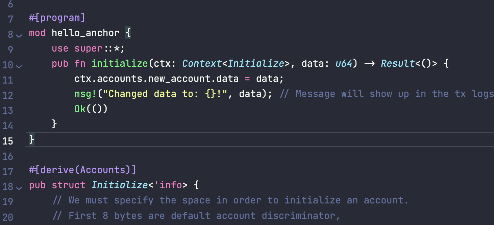
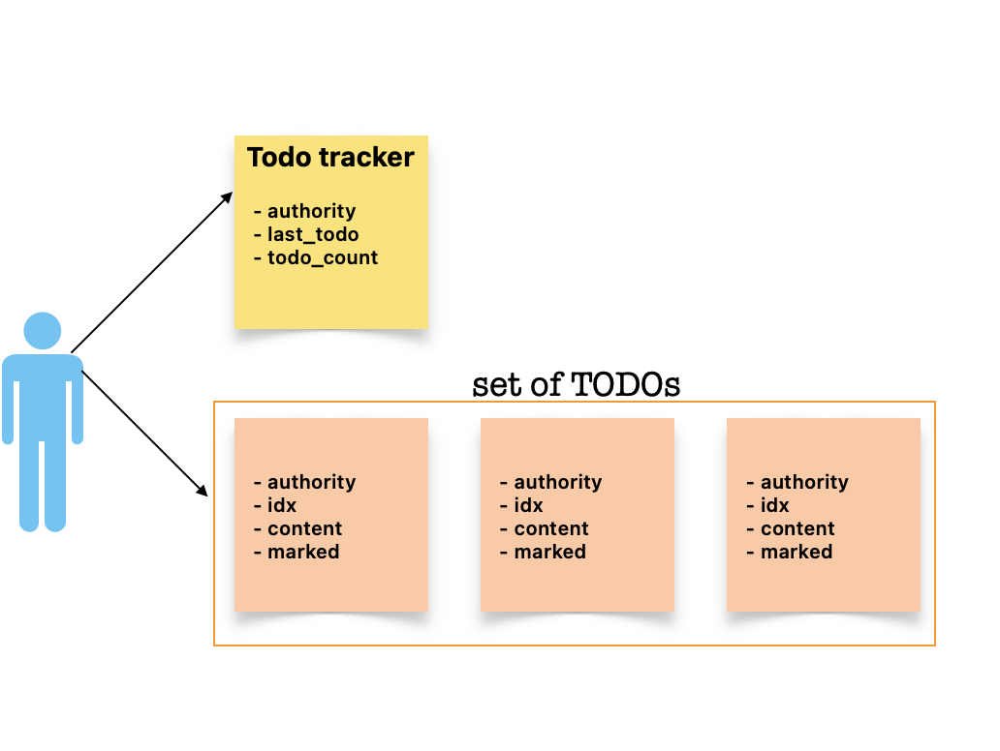

# sol-playground

A playground for writing, compiling, testing smart contracts on Solana chain(s): Mainnet, Testnet, Devnet.

## About

- [Anchor lang](https://docs.rs/anchor-lang/latest/anchor_lang/index.html) for writing smart contracts on Solana.
  - Rust eDSL for writing safe, secure, and high level Solana programs
- IDL ~ ABI

## Installation

> The following is for macOS M1 & also for Lima VM run on top of macOS M1.

> - Issue for **macOS M1**: not able to run `solana-test-validator`. Solved via Troubleshoot [#3](https://github.com/abhi3700/sol-playground/blob/main/README.md#3-error-1-19521-illegal-hardware-instruction-solana-test-validator).
> - Issue for **lima VM**: Still unsuccessful with `solana` installation. Tried with source. getting this error: `No package 'libudev' found` (TODO: fix this)

### Rust

macOS M1 ✅ | lima VM ✅

Follow [this](https://github.com/abhi3700/My_Learning-Rust/blob/main/README.md#installation)

### Solana

macOS M1 ✅ | lima VM

[Learn Solana concepts](https://github.com/abhi3700/My_Learning_Solana)

This is for compiling solana contracts/programs.

#### M-1: Install using `brew`

Install/Update using `brew`

```console
$ brew install solana
```

update `solana-install`

```console
❯ solana-install update
Install is up to date. 1.10.40 is the latest compatible release

❯ solana --version
solana-cli 1.13.4 (src:devbuild; feat:4011803773)
```

Here, the problem is that the `solana-test-validator` fails on console. Hence, it is recommended to install using source via following Troubleshooting [#3](https://github.com/abhi3700/sol-playground/blob/main/README.md#3-error-1-19521-illegal-hardware-instruction-solana-test-validator).

---

Uninstall:

```console
$ brew uninstall solana
```

#### M-2: Install using binaries [RECOMMENDED]

[SOURCE](https://solanacookbook.com/getting-started/installation.html#downloading-binaries)

1. Download specific version's binaries with name: `solana-release-aarch64-apple-darwin.tar.bz2` from [releases page](https://github.com/solana-labs/solana/releases) into home directory i.e. `~`
2. Then, extract the folder via double-click the folder, into home directory. While writing this doc, it's `1.13.3 version`.
3. Now, rename the folder from `solana-releases` to `solana-1.13.3`. No need to `cargo build` as it's already built. Just link the binaries to `PATH`.
4. Add the following to `~/.zprofile`:

   ```console
   export PATH="$HOME/solana-1.13.3/bin:$PATH"
   ```

5. Activate the changes:

   ```console
   $ source ~/.zprofile
   ```

6. Check the version:

   > In case of access denied to the binary CLI command execution, just go to Finder App & right click on the binary file & click on `Open With Terminal` option. Then, it will ask for the permission to execute the binary file. Click on `Open` option & then it will work.

   ```console
   ❯ solana -V
    solana-cli 1.13.3 (src:3271b83d; feat:4011803773)
   ```

7. Check for `solana-test-validator` if running properly:

   ```console
   ❯ solana-test-validator
   ```

   > If you get this error: `Error: 1:19521 Illegal hardware instruction (core dumped)`, then follow Troubleshooting [#3](https://github.com/abhi3700/sol-playground/blob/main/README.md#3-error-1-19521-illegal-hardware-instruction-solana-test-validator).

---

In case of any update, if needed just follow the steps from `#1` to `#6`. Don't follow `$ solana-install update` as it's meaningless.

```console
# I am using 1.13.3 version already. So, it's not updating.
❯ solana-install update
Install is up to date. 1.10.40 is the latest compatible release
```

### NodeJS

macOS M1 ✅ | lima VM ✅

This is for writing unit tests using Javascript or Typescript.

- `nvm`
- `node`
- `npm`
- `yarn`

Check the installation steps [here](https://github.com/abhi3700/My_Learning_NodeJSTS/blob/main/README.md#installation).

### Anchor

macOS M1 ✅ | lima VM ✅

This is similar to Hardhat/Truffle/Foundry/Brownie (for EVM contracts). [Know more](./anchor)

> Don't follow `npm` to install `anchor-cli` i.e. don't use this command: `$ npm install -g @project-serum/anchor-cli` on macOS. Otherwise you will get this error:

```console
❯ anchor
Only x86_64 / Linux distributed in NPM package right now.
Trying globally installed anchor.
```

> Following is true for both macOS & linux VM like lima.

Hence, install using `avm`. Anchor version manager (`avm`) is a tool for using multiple versions of the `anchor-cli`.

It's better to use `avm` to manage multiple versions of `Anchor`.

```console
$ cargo install --git https://github.com/coral-xyz/anchor avm --locked --force
```

To use latest version, try this:

```console
$ avm install latest
$ avm use latest
```

---

In case of any issue for **Ubuntu**, do this first:

```console
$ sudo apt-get update && sudo apt-get upgrade && sudo apt-get install -y pkg-config build-essential libudev-dev libssl-dev
```

## [CLI](./cli)

## Getting started

1. Start a project `$ anchor init hello-solana`
2. write the code in `src/lib.rs` & add supported files
   - `constant.rs`
   - `error.rs`
   - `states.rs`
3. Build: `$ anchor build`
4. Get the program address during build: `$ solana address -k <KEYPAIR-FILE-PATH>` e.g. `$ solana address -k target/deploy/hello_solana-keypair.json`
   ```console
    ❯ solana address -k target/deploy/hello_solana-keypair.json                                     ⏎
    BTc32GfyocV5yZvSqvLvyefkLftyHfG92Sxao2KaLqiD
   ```
5. Now, add the address into `Anchor.toml` file & also in `src/lib.rs` in `declare_id!()` macro.
6. Check sufficient SOL/lamports in the deployer (default keypair is `~/.config/solana/id.json`) account: `$ solana balance`:

   - If not, then fund the account: `$ solana airdrop 1`, for localnet it's not needed though.
   - Check balance again: `$ solana balance`

   ```console
    ❯ solana balance                                                                                ⏎
    500000000 SOL
   ```

7. For localnet (ensure `$ solana config get` -> connected to localnet), deploy: `$ anchor deploy` or `$ solana program deploy target/deploy/hello_world-keypair.json`

   > Run `solana-test-validator` in another terminal.

   Using `anchor-cli`:

   ```console
   ❯ anchor deploy                                                  ⏎
   Deploying workspace: http://localhost:8899
   Upgrade authority: /Users/abhi3700/.config/solana/id.json
   Deploying program "hello-solana"...
   Program path: /Users/abhi3700/F/coding/github_repos/sol-playground/sc/hello-solana/target/deploy/hello_solana.so...
   Program Id: BTc32GfyocV5yZvSqvLvyefkLftyHfG92Sxao2KaLqiD
   ```

   **OR**

   Using `solana-cli`:

   ```console
   ❯ solana program deploy target/deploy/hello_solana.so                                           ⏎
   Program Id: BTc32GfyocV5yZvSqvLvyefkLftyHfG92Sxao2KaLqiD
   ```

   View the program details:

   ```console
   ❯ solana program show BTc32GfyocV5yZvSqvLvyefkLftyHfG92Sxao2KaLqiD

   Program Id: BTc32GfyocV5yZvSqvLvyefkLftyHfG92Sxao2KaLqiD
   Owner: BPFLoaderUpgradeab1e11111111111111111111111
   ProgramData Address: DR6WL7PQRepVzw7q772gZ9tf8CQGmhcrc8BX2vfgabyp
   Authority: HTeVsf7bg3EuAKKpg74p4soHVoxJAYCSmK2PBJZt8Dyu
   Last Deployed In Slot: 87
   Data Length: 356368 (0x57010) bytes
   Balance: 2.48152536 SOL
   ```

8. Test: `$ anchor test`
9. Upgrade (if required).

   ```console
   ❯ solana program deploy target/deploy/hello_solana.so
   Program Id: BTc32GfyocV5yZvSqvLvyefkLftyHfG92Sxao2KaLqiD
   ```

   View the program details:

   ```console
   ❯ solana program show BTc32GfyocV5yZvSqvLvyefkLftyHfG92Sxao2KaLqiD

    Program Id: BTc32GfyocV5yZvSqvLvyefkLftyHfG92Sxao2KaLqiD
    Owner: BPFLoaderUpgradeab1e11111111111111111111111
    ProgramData Address: DR6WL7PQRepVzw7q772gZ9tf8CQGmhcrc8BX2vfgabyp
    Authority: HTeVsf7bg3EuAKKpg74p4soHVoxJAYCSmK2PBJZt8Dyu
    Last Deployed In Slot: 8360
    Data Length: 356368 (0x57010) bytes
    Balance: 2.48152536 SOL
   ```

---

- [Greeting contract](https://learn.figment.io/tutorials/deploy-solana-program)
- About: It's a simple program, all it does is increment a number every time it's called.
- Here, fetch the greeting account's `counter` attribute >> increment by 1 >> store it back >> log the stored value

## Coding

### Program

- the account variable can only be edited if the account's owner public key matches with the `program_id`

```rs
if (account.owner == program_id) {
//the variable can be edited.
}
```

To detect whether an address is a program, just check the account info (fetched from outside the SC) is not `NULL` or check if the `program_id` has `is_executable` as `true` (can be done from inside/outside the SC).

- When we write a program, we should add function/instruction & then corresponding Account (in form of struct) & then test.
- Add `#[program]` attribute to the mod, which contains all the functions/instruction
- The prelude contains all commonly used components of the crate. All programs should include it via `anchor_lang::prelude::*;`

### Function

Every function usually comes with a struct like this:



**L-10:14 & L-18:** shows that.

---

### Error

- `#[error]` attribute is used to define custom errors like this:

  ```rs
  #[error_code]
  pub enum TodoError {
     #[msg("You are not authorized to perform this action.")]
     Unauthorized,
     #[msg("Not allowed")]
     NotAllowed,
     #[msg("Math operation overflow")]
     MathOverflow,
     #[msg("Already marked")]
     AlreadyMarked,
  }
  ```

### Mapping

Unlike solidity, we can't use `mapping` in case of Solana, but rather we use the authority pattern like this:

```rs
#[account]
#[derive(Default)]
pub struct UserProfile {
   pub authority: Pubkey,
   pub last_todo: u8,
   pub todo_count: u8,
}

#[account]
#[derive(Default)]
pub struct TodoAccount {
   pub authority: Pubkey,
   pub idx: u8,
   pub content: String,
   pub marked: bool,
}
```

Imagine a person maintaining TODOs on Solana, the architecture would be like this:



Here, a person would have 1 yellow colored account (todo tracker) & multiple orange colored accounts (todo item) for different TODOs.

In solidity, we would have written like this:

```solidity
struct Todo {
   string content;
   bool marked;
}

mapping(address => Todo[]) public todos;
```

## SC Security

- Owner check
- Owner signer
- Tool: `Soteria` [source](https://medium.com/coinmonks/soteria-a-vulnerability-scanner-for-solana-smart-contracts-cc202cf17c99)

## Tools

- **Gelato** (transaction scheduling) like tool: [**Clockwork**](https://docs.clockwork.xyz/about/readme)
  > Developers can use Clockwork to schedule transactions and automate smart-contracts without relying on centralized infrastructure. This allows developers to build more complex and robust applications on Solana.
- Remix like IDE for Solana - https://beta.solpg.io/

## Troubleshoot

### 1. Error: Balance unchanged

- _Cause_: This is because of exceeding 5 tokens as airdrop.
- _Solution_: try <=5 tokens as airdrop `$ solana airdrop 5`

### 2. Error: Account 4aUirUHybwAmuEJPorfeWeWNk4nTgujAkPo2aodNvTv6 has insufficient funds for spend (1.21953816 SOL) + fee (0.000885 SOL)

- _Cause_: This is because of insufficient fund in the program deployer account.
- _Solution_:Airdrop some tokens (a min. of `1.22042316 SOL`) `$ solana airdrop 5 4aUirUHybwAmuEJPorfeWeWNk4nTgujAkPo2aodNvTv6` or `$ solana airdrop 5`

### 3. Error: [1] 19521 illegal hardware instruction solana-test-validator

- _Cause_: This happens on Mac M1 processor
- _Solution_: Uninstall Solana, Rust & then install from scratch using the following steps shown [here](https://dev.to/nickgarfield/how-to-install-solana-dev-tools-on-an-m1-mac-kfn)

  1. Make sure that "Open using Rosetta" is disabled in the terminal
     - Open Finder & search for "Terminal"
     - Right click on "Terminal" App & click "Get info"
     - Ensure that the "Open using Rosetta" option is diabled.
  2. Uninstall Solana: `$ rm -rf /Users/abhi3700/.local/share/solana/`
  3. Uninstall Rust: `$ rustup self uninstall`
  4. Setup Rosetta: `$ /usr/sbin/softwareupdate --install-rosetta --agree-to-license`
     - Now, we will create duplicate copy of "Terminal" App (search in finder)
     - Name it as "Terminal Rosetta"
     - Make sure the "Open using Rosetta" option is enabled.
  5. Now, use "Terminal Rosetta" from hereon. [OPTIONAL] Make the background color to something else by clicking <kbd>cmd+i</kbd> on opened terminal to make it look different.
  6. Install Rust, Cargo: `$ curl --proto '=https' --tlsv1.2 -sSf https://sh.rustup.rs | sh`
  7. Install Homebrew using the x86 instruction set. Note the prefix used `arch -x86_64`: `$ arch -x86_64 /bin/bash -c "$(curl -fsSL https://raw.githubusercontent.com/Homebrew/install/master/install.sh)"`
  8. Also install OpenSSL in x86 instruction set, but get error like this:

  ```console
  // install openssl inside intel processor
  $ arch -x86_64 brew install openssl@1.1
  Error: Cannot install under Rosetta 2 in ARM default prefix (/opt/homebrew)!
  To rerun under ARM use:
    arch -arm64 brew install ...
  To install under x86_64, install Homebrew into /usr/local.
  ```

Then tried doing under ARM and it was success.

```console
$ arch -arm64 brew install openssl@1.1
```

9. Create a new file via `$ touch ~/.cargo/config` and copy paste this:

```console
[target.x86_64-apple-darwin]
rustflags = [
  "-C", "link-arg=-undefined",
  "-C", "link-arg=dynamic_lookup",
]

[target.aarch64-apple-darwin]
rustflags = [
  "-C", "link-arg=-undefined",
  "-C", "link-arg=dynamic_lookup",
]
```

10. [For UPDATE, start from this step] Now, clone solana from source via `$ git clone https://github.com/solana-labs/solana.git`. NOTE: Do it in the home directory & then won't be deleted by mistake.
    - first download the `solana-release-aarch64-apple-darwin.tar.bz2` file from [here](https://github.com/solana-labs/solana/releases) into home directory i.e. `/Users/abhi3700/`
    - Then, extract the folder via double-click into home directory. While writing, it's `1.13.3 version`.
    - Now, get `solana-1.14.7` folder from `solana-1.14.7.tar.gz`. You can delete the `tar.gz` file.
    - More to the folder: `$ cd solana-1.14.7`
11. Build

```console
$ cargo build
```

12. Install coreutils

```console
$ arch -arm64 brew install coreutils
```

13. Install script to generate binaries into `./bin` folder. (takes `1123 seconds`)

```console
$ ./scripts/cargo-install-all.sh .
```

14. Add the binaries folder into the PATH.
    > Skip step `#11` to `#13` if already available with binary. In case of access denied to the binary CLI command execution, just go to Finder App & right click on the binary file & click on `Open With Terminal` option. Then, it will ask for the permission to execute the binary file. Click on `Open` option & then it will work.

```console
// open .zprofile in VSC editor
$ code ~/.zprofile

// Add this line to EOL
export PATH="/Users/abhi3700/solana-1.14.7"/bin:"$PATH"

// activate command
$ source ~/.zprofile
```

> NOTE: For multiple versions just open `~/.zprofile` file & change the version via commenting the previous version. Also, make sure that the path exist. Hence, it looks like this:

```
# export PATH="/Users/abhi3700/solana-1.8.0"/bin:"$PATH"
# export PATH="/Users/abhi3700/solana-1.8.5"/bin:"$PATH"
# export PATH="/Users/abhi3700/solana-1.9.4"/bin:"$PATH"
export PATH="/Users/abhi3700/solana-1.14.7"/bin:"$PATH"
```

1.  Run the commands like `solana`, `solana-test-validator`. NOTE: all the blocks will be stored in `test-ledger/` [Better to delete after the localnet running is done]. To shutdown this, press <kbd>ctrl+c</kbd> and then restart from the stopped block.

```console
❯ solana-test-validator                                                       ⏎
Ledger location: test-ledger
Log: test-ledger/validator.log
Identity: 3RvvwAbhmFDeF8n9SgMKKTyphDev3s9Gx6mefR65o19N
Genesis Hash: DrFFgvyNjJXgfRBgPDcTgQ7WmyFE2BkX1aRK5s8twrod
Version: 1.14.7
Shred Version: 62237
Gossip Address: 127.0.0.1:1024
TPU Address: 127.0.0.1:1027
JSON RPC URL: http://127.0.0.1:8899
⠄ 00:00:10 | Processed Slot: 19 | Confirmed Slot: 19 | Finalized Slot: 0 | Snaps
```

16. Now, during Anchor `build` might occur an issue related to `bpf` folder does not exist as the `solana` has been installed from source. So, follow "Error-4" for doing the additional step of copying `sdk/bpf/` folder into `~/.cargo/bin/`.

### 4. Error: BPF SDK path does not exist: /Users/abhi3700/.cargo/bin/sdk/bpf: No such file or directory (os error 2)

- _Cause_: This happens during `$ anchor build`. This error occurs as the `solana` has been installed from source.
- _Solution_: Just copy `~/solana-1.14.7/bin/sdk` to here: `~/.cargo/bin/`. Note: there might be `sdk` shortcut. Just replace this with the `sdk` folder containing `bpf/`. Then it would build successfully.

### 5. Program deployment error:

- _Error_:

```
Error: Custom: Invalid blockhash
There was a problem deploying: Output { status: ExitStatus(unix_wait_status(256)), stdout: "", stderr: "" }.
```

- _Cause_:
  - It could be due to `solana-cli` conflict.
  - It could be because the new `program_id` generated into `target/deploy/` is put into the `declare_id`, `Anchor.toml`.
- _Solution_: Check the 2 things above.
  - try with `solana-1.8.0`, if not working with `solana-1.9.4`,

```console
solana-cli 1.8.0 (src:4a8ff62a; feat:1813598585)
anchor-cli 0.20.1
rustc 1.57.0 (f1edd0429 2021-11-29)
```

## References

- [Solana Wiki, comparison to Ethereum](https://solana.wiki/zh-cn/docs/ethereum-comparison/)
- [Solana vs Ethereum account](https://solana.wiki/zh-cn/docs/ethereum-comparison/account/)
- [Solana Cookbook](https://solanacookbook.com/)
- [Anchor - Solana Smart Contract Framework](https://www.anchor-lang.com/)
- [Anchor Book](https://book.anchor-lang.com/introduction/introduction.html)
- [Solana internals Part 1: what are the native on-chain programs and why do they matter?](https://medium.com/coinmonks/solana-internals-part-1-what-are-the-native-on-chain-programs-and-why-do-they-matter-61c981483e86)
- [Get started with Anchor](https://project-serum.github.io/anchor/tutorials/tutorial-0.html)
- [Build Solana Anchor Blog with Svelte Front end Tutorial - Part 1 (Rust)](https://www.youtube.com/watch?v=w-n87Aq3f8k)
- [Solana Tutorial | Solana for Developers](https://www.youtube.com/watch?v=qNIhClYDjR8)
- [Building SmartContracts With #Solana and #Rust](https://www.youtube.com/watch?v=gA7hFdq2h9Q)
- [The Complete Guide to Full Stack Solana Development with React, Anchor, Rust, and Phantom](https://dev.to/dabit3/the-complete-guide-to-full-stack-solana-development-with-react-anchor-rust-and-phantom-3291)
- [Learning How to Build on Solana](https://www.brianfriel.xyz/learning-how-to-build-on-solana/)
- [ok so what the fuck is the deal with solana anyway](https://2501babe.github.io/posts/solana101.html)
- [Solana Development Tutorial: Key Concepts](https://solongwallet.medium.com/solana-development-tutorial-key-concepts-62b6d9077bb9)
- [Solana Transactions in Depth](https://medium.com/@asmiller1989/solana-transactions-in-depth-1f7f7fe06ac2)
- [SOL dev](https://soldev.app/)
  - [Tutorials](https://soldev.app/library/tutorials)
  - [Articles](https://soldev.app/library/articles)
  - [Projects](https://soldev.app/library/projects)
  - [Scaffolds](https://soldev.app/library/scaffolds)
    > Build Dapps on Solana with these templates
  - [Tools](https://soldev.app/library/tools)
- [NFT Developer Studio for Solana](https://docs.metaplex.com/)
- [Program library | by Solana-labs](https://soldev.app/library/spl)

### Tutorials

- [Create a Solana dApp from scratch](https://lorisleiva.com/create-a-solana-dapp-from-scratch) `best`
  > Using anchor lang/framework
- [By Figment](https://learn.figment.io/protocols/solana)
- [Solana Tutorial: Creating PDA's with Anchor](https://www.youtube.com/watch?v=A1TMZxZz9Q8)
- Solana 101:
  - [Introduction](https://learn.figment.io/tutorials/solana-101)
  - [Setup the project](https://learn.figment.io/tutorials/setup-the-project)
  - [Connect to the Solana Devnet](https://learn.figment.io/tutorials/connect-to-devnet)
  - [Create a Keypair](https://learn.figment.io/tutorials/create-solana-keypair)
  - [Fund the account](https://learn.figment.io/tutorials/fund-solana-account)
  - [Check the account balance](https://learn.figment.io/tutorials/check-solana-account-balance)
  - [Transfer SOL tokens](https://learn.figment.io/tutorials/transfer-sol-tokens)
  - [Deploy a program](https://learn.figment.io/tutorials/deploy-solana-program)
  - [Create a Greeter account](https://learn.figment.io/tutorials/how-to-store-state)
  - [Get Greetings' count](https://learn.figment.io/tutorials/get-greetings)
  - [Send Greetings](https://learn.figment.io/tutorials/send-greetings)

### Security

- [Security](https://soldev.app/library/security)
- [From Ethereum smart contracts to Solana programs: two common security pitfalls and beyond](https://medium.com/coinmonks/from-ethereum-smart-contracts-to-solana-programs-two-common-security-pitfalls-and-beyond-ea5b919ade1c)
- [Solana Smart Contracts: Common Pitfalls and How to Avoid Them](https://blog.neodyme.io/posts/solana_common_pitfalls)
- [Soteria — A vulnerability scanner for Solana smart contracts](https://medium.com/coinmonks/soteria-a-vulnerability-scanner-for-solana-smart-contracts-cc202cf17c99)

### Videos

- [YT playlist](https://soldev.app/library/playlists)
- [Solana Tutorial: Creating PDA's with Anchor](https://www.youtube.com/watch?v=A1TMZxZz9Q8)
