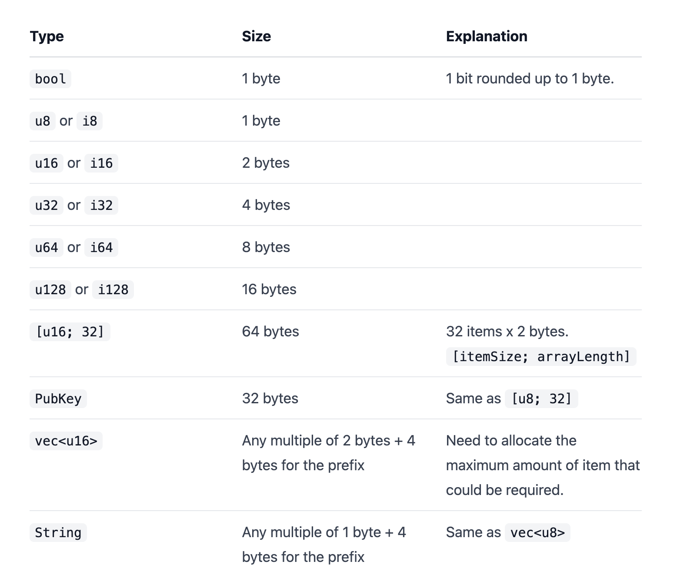

# Anchor

A testing framework for Solana programs

## [Installation](../README.md#anchor)

## Commands

- `anchor localnet` is equivalent to:

```sh
anchor build
solana-test-validator --reset

# The local ledger will stay active after deployment.
```

### Init/Create Project

- Init a project: `$ anchor init <project-name>` (by default Typescript)
  > Anchor used a random placeholder in two places as our program ID that we can now replace. The first is in the `./programs/<project-name>/src/lib.rs` file, and the second is in the `./Anchor.toml` file.
- Init a project using JS: `$ anchor init <project-name> --javascript`
- Init a project with no git: `$ anchor init <project-name> --no-git`
- Project directory:

```
app - Where our frontend code will go

programs - This is where the Rust code lives for the Solana program

test - Where the JavaScript tests for the program live

migrations - A basic deploy script
```

### Build

- Example:

```
❯ anchor build
BPF SDK: /Users/abhi3700/.local/share/solana/install/releases/1.8.5/solana-release/bin/sdk/bpf
cargo-build-bpf child: rustup toolchain list -v
cargo-build-bpf child: cargo +bpf build --target bpfel-unknown-unknown --release
    Finished release [optimized] target(s) in 0.33s
cargo-build-bpf child: /Users/abhi3700/.local/share/solana/install/releases/1.8.5/solana-release/bin/sdk/bpf/dependencies/bpf-tools/llvm/bin/llvm-readelf --dyn-symbols /Users/abhi3700/F/coding/github_repos/crunchy-vs-smooth/target/deploy/crunchy_vs_smooth.so

To deploy this program:
  $ solana program deploy /Users/abhi3700/F/coding/github_repos/crunchy-vs-smooth/target/deploy/crunchy_vs_smooth.so
The program address will default to this keypair (override with --program-id):
  /Users/abhi3700/F/coding/github_repos/crunchy-vs-smooth/target/deploy/crunchy_vs_smooth-keypair.json
```

- `anchor build` is combination of:

```
$ cargo build-bpf
$ anchor idl parse -f program/src/lib.rs -o target/idl/basic_0.json
```

- After this,
  - `target/` folder gets generated.
  - IDL is found at `target/idl/<project-name>.json`, which is similar to ABI in solidity and will be using them in a similar way in our JavaScript tests and frontends to communicate with our Solana program via RPC.
  - `program-id` also gets generated. View via
    - M-1 Using (solana-cli): `$ solana address -k target/deploy/crunchy_vs_smooth-keypair.json`
    - M-2 Using (solana-keygen): `$ solana-keygen pubkey target/deploy/crunchy_vs_smooth-keypair.json`
    - M-3 Using (anchor-cli): `anchor keys list`
- Replace the `program-id` in 2 places:

#### 1. `./programs/<project-name>/src/lib.rs`

```
declare_id!("EGzbH5pZmHhm26PBtEYA57WsLUkGA2vqn8vhsREenfNS");
```

#### 2. `./Anchor.toml`

```
[programs.localnet]
crunchy_vs_smooth = "EGzbH5pZmHhm26PBtEYA57WsLUkGA2vqn8vhsREenfNS"

[programs.devnet]
crunchy_vs_smooth = "EGzbH5pZmHhm26PBtEYA57WsLUkGA2vqn8vhsREenfNS"
```

### Test

### Deploy

- 2 ways to add details of network, deployer's wallet during deployment: `cluster` param's value in the `Anchor.toml` file of the repo.

  - M-1: `$ anchor deploy` as CLI command. The provider's info in `Anchor.toml` file:

  ```
  [provider]
  cluster = "devnet"
  wallet = "~/.config/solana/id.json"
  ```

  - M-2: `$ anchor deploy --provider.cluster devnet --provider.wallet ~/.config/solana/id.json`

```
// it's redundant to use the above provider info in `Anchor.toml` file
```

> If the wallet address' directory is in different place that the default, then parse that which contains faucet.

> Before deployment, make sure that the new program ID generated during `build` is added in the `Anchor.toml` & `lib.rs` files like this:

1. `Anchor.toml`

```toml
[programs.localnet]
solana_twitter = "Gy1q1wi3V1Xiji2PgoYSEcu4pcqjy7D8vr9HJhfAQpnt"
```

2. `lib.rs`

```rust

declare_id!("Gy1q1wi3V1Xiji2PgoYSEcu4pcqjy7D8vr9HJhfAQpnt");
```

- To **devnet**: Get the output file location from `$ anchor build`

```sh
# M-1.1: using solana
# This works, if in `~/.config/solana/cli/config.yml` directory, it is connected to the same network as we want to deploy on. Otherwise, use M-1.2
❯ solana program deploy target/deploy/crunchy_vs_smooth.so
```

OR

```sh
# M-1.2: using solana with customization
# This is used when deploying with a specific address (having some SOL already).
# Then, need to provide the file directory containing private key.
# Very useful when deploying on mainnet using an account which already owns valuable SOL tokens (for transaction fees).
❯ solana program -k <~/solanawallet.json> deploy target/deploy/crunchy_vs_smooth.so -u https://api.devnet.solana.com

# Output
Program Id: G36EspggVjxkDEKfHGXjsrHjt2sLPJa2hhomSNijzuTx

# M-2: using anchor
❯ anchor deploy --provider.cluster devnet ⏎
Deploying workspace: https://api.devnet.solana.com
Upgrade authority: /Users/abhi3700/.config/solana/id.json
Deploying program "crunchy-vs-smooth"...
Program path: /Users/abhi3700/F/coding/github_repos/sol_contracts_crunchyvssmooth/target/deploy/crunchy_vs_smooth.so...
Program Id: G36EspggVjxkDEKfHGXjsrHjt2sLPJa2hhomSNijzuTx

Deploy success
```

> NOTE: `$ anchor deploy` is for localnet. Here, in another terminal tab, start the node via `solana-test-validator`

> NOTE: the wallet account must have token balance for deployment. If not created

### Upgrade

```sh

# M-1: using solana
❯ solana program deploy target/deploy/crunchy_vs_smooth.so --program-id G36EspggVjxkDEKfHGXjsrHjt2sLPJa2hhomSNijzuTx
Program Id: G36EspggVjxkDEKfHGXjsrHjt2sLPJa2hhomSNijzuTx

# M-2: using anchor
❯ anchor upgrade target/deploy/counter.so --provider.cluster devnet --program-id G36EspggVjxkDEKfHGXjsrHjt2sLPJa2hhomSNijzuTx ⏎
Program Id: G36EspggVjxkDEKfHGXjsrHjt2sLPJa2hhomSNijzuTx
```

## Concepts

[Solana vs Anchor](https://github.com/abhi3700/My_Learning_Solana/blob/main/faqs.md#q-why-use-anchor-in-writing-solana-programs)

[Source](https://hashnode.com/post/anchor-framework-simplified-for-new-developers-in-solana-cktyttmwf09h6bps189wxcngd)

- Solana program architecture uses `Entrypoint`, `State`, `Processor`, `Instruction`, `Lib` and `Error` files. So, these are taken care of `Anchor`.
- Anchor has modules, modules are basically a way of grouping structs, functions, methods etc in a large program to make it more easier to export and reuse.
- `serialization` & `deserialization`: translate data structure or objects into a format(bytes) that can be stored or transmitted. In other words, serialize/deserialize is to pack/unpack data. E.g. In a Redis DB, in order to store an image, it is encoded & in order to retrieve the image, it is decoded.

> Here, in Solana programs, mostly `accounts`, `structs` are serialized or deserialized.

```rs
// extract stored data from an account
let mut data = account.try_borrow_mut_data();

// unpack the data
let mut unpacked = Message::unpack(&data).expect("Failed to read data");

// modify a param `txt` of unpacked data to `txtFinal` of str type.
unpacked.txt = txtFinal

// Then, pack the data
unpacked.pack(&mut data);
```

The entire snippet can be seen [here](../img/borsh_serialize.png).

## Coding

- 2 imports to start with: `prelude`, `state`.
- In anchor, there are no separate files for programs `entrypoint`, `state`, `processor`, `instructions` etc.
- the `#[program]` attribute initialises the instructions to be passed and should be enclosed in a module (`mod{}`).

```rs
#[program]
pub mod hello {

}
```

## Space

Amount of space allocated to each type of struct defined in an account.



## References

- [List of account constraints](https://docs.rs/anchor-lang/latest/anchor_lang/derive.Accounts.html)
